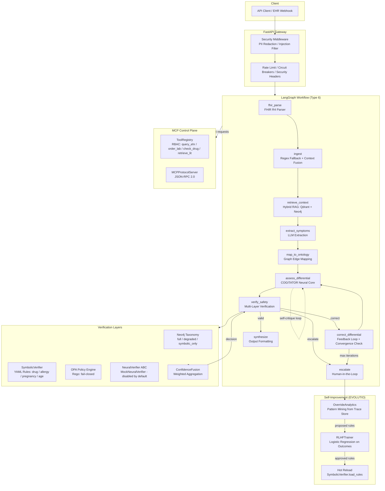
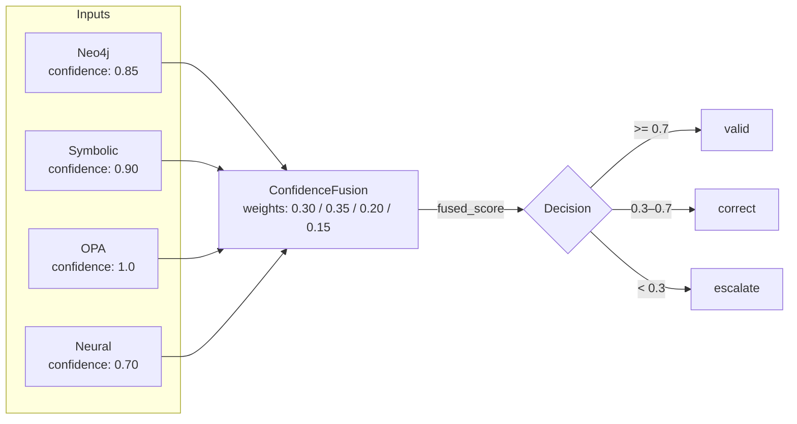
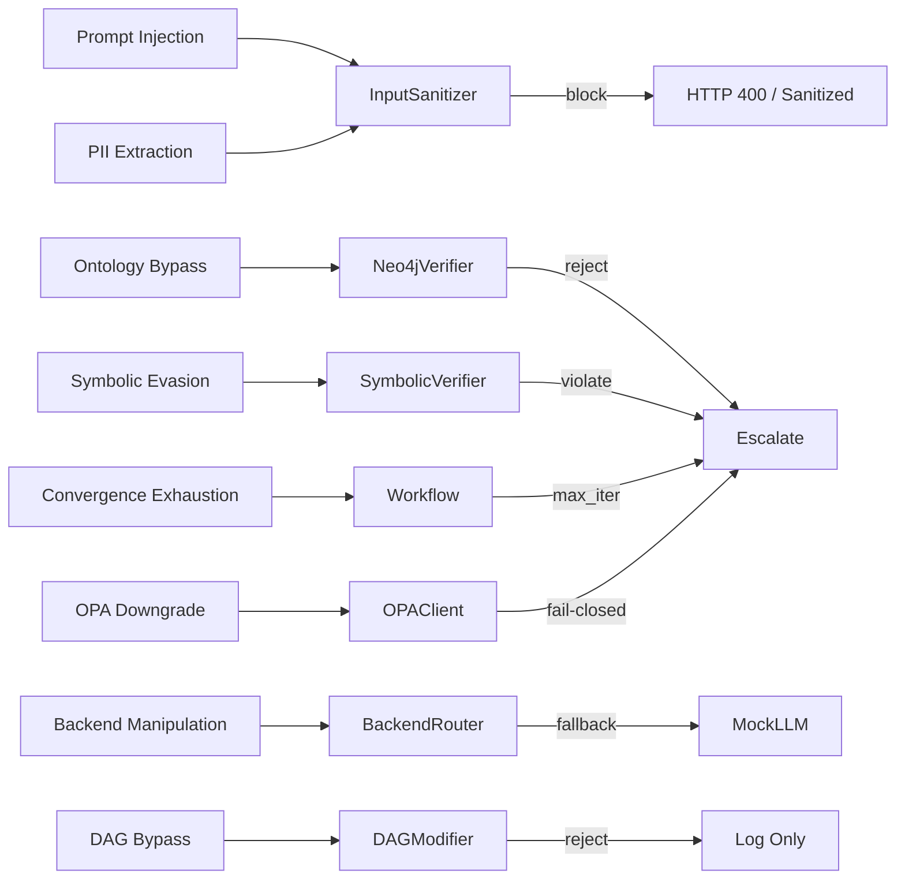

<h1 align="center">Speculative Clinical GraphRAG</h1>

<p align="center">
  <b>A Type 6 Neuro-Symbolic Architecture Reference Implementation.</b><br>
  Symbolic guardrails constrain neural reasoning. Every diagnostic path is
  graph-verified, policy-checked, and human-escalatable.
</p>

<p align="center">
  
  
  
  
  
  
  
  
  
  
</p>

---

## ⚠️ What This Is (And Isn't)

| This Is | This Isn't |
|---------|-----------|
| A **reference implementation** of Type 6 Neuro[Symbolic] architecture | A production clinical device (no FDA 510(k), no HIPAA BAA) |
| A **safety-first scaffold** designed to accept real ontologies, EHRs, and models | A deployed system connected to real patient records |
| An **adversarially red-teamed** multi-agent workflow with 227+ tests | A finished product with validated clinical efficacy |
| A **portfolio piece** demonstrating architectural depth, not marketing claims | A startup pitch deck |

---

## Architecture



### Architecture Evolution

| Phase | Version | Status | Description |
|-------|---------|--------|-------------|
| R0 | v0.1.0 | ✅ | Mock ontology, basic LangGraph workflow |
| R1 | v0.2.0 | ✅ | Neo4j integration, multi-layer verification |
| R2 | v0.3.0 | ✅ | FHIR parser, external YAML rules, convergence detection, property tests |
| R3 | v0.5.0 | ✅ | NeuralVerifier ABC, AgentRegistry, ConfidenceFusion, DAGModifier, OverrideAnalytics |
| Type 6 | v0.6.0 | ✅ | COGITATOR self-critique, NeuralPolicy routing, EVOLUTIO learning |
| R4.1 | v0.6.1 | ✅ | RLHF training pipeline, admin endpoints |
| R4.2 | v0.6.2 | ✅ | MCP Protocol (JSON-RPC 2.0), clinical tool registry |
| **R5** | **v0.6.4** | **✅** | **Security hardening, PII redaction, adversarial red-teaming, load testing** |
| R6 | v0.7.0 | ⏳ | Glass Box UI, MCP tool_enrichment in workflow |
| Production | v1.0.0 | ⏳ | FDA alignment, real SNOMED-CT/UMLS, horizontal scale, SOC 2 |

### Type 2 Safety Invariants (Non-Negotiable)

These invariants are hardcoded and cannot be overridden by neural components:

| Invariant | Enforcement | Evidence |
|-----------|-------------|----------|
| Symbolic rules dominate by default | `enable_neural=false`, `enable_neural_policy=false` defaults | `core/workflow.py` |
| Max iterations → escalate | `iteration_count >= max_iterations` routes to escalate | `core/neural_policy.py` |
| Symbolic unsafe + high risk → escalate | Neural policy override regardless of heuristic score | `core/neural_policy.py` `predict()` |
| OPA fail-closed | Unreachable OPA returns `allow=False` | `core/verification_layer.py` |
| Immutable nodes protected | `ingest`, `verify_safety`, `escalate`, `fhir_parse` cannot be removed | `core/dag_modifier.py` |
| Human approval for self-modification | All generated rules have `status: pending_approval` | `core/evolutio.py` |
| PII redaction | SSN, phone, email, DOB, MRN redacted before LLM processing | `core/security.py` |
| Prompt injection blocking | Pattern-based detection blocks suspicious inputs with HTTP 400 | `core/security.py` |

### Confidence Fusion: From Boolean AND to Weighted Aggregation

Traditional clinical AI uses boolean logic: `neo4j_valid AND symbolic_valid AND opa_allowed`. This is brittle — one false positive blocks a valid path. This system uses probabilistic confidence fusion:



### Adversarial Safety Architecture

The system was red-teamed with 35 adversarial tests across 10 attack classes:



## Perception Module: From Raw Data to Cognition

The perception layer transforms unstructured, multi-modal clinical inputs into a **structured, policy-validated, normalized state** before any neural reasoning occurs. It is deterministic, fail-closed, and runs in <50ms.

### 1. Data Ingestion

| Source | Format | Entry Point |
|--------|--------|-------------|
| EHR system | FHIR R4 Bundle | `POST /v1/speculate` `patient_context` |
| Free-text note | Plain text | `POST /v1/speculate` `patient_note` |
| Direct API | JSON | `POST /v1/speculate` |

### 2. Preprocessing Tracks

**Track A — Structured (FHIR):**
```python
# core/fhir_parser.py
FHIR Bundle → FHIRParser.parse_bundle() → patient_context dict
Patient → age, gender
Observation → lab values (eGFR, WBC, creatinine)
MedicationRequest → active medications
AllergyIntolerance → documented allergies
Condition → comorbidities
```

**Track B — Unstructured (Free Text):**
```python
# core/security.py → core/workflow.py _ingest()
patient_note → InputSanitizer.sanitize_patient_note()
PII redaction: SSN, email, phone, DOB, MRN → [REDACTED]
Prompt injection detection: blocks "ignore previous instructions", {{}}, <|...|>, special token abuse
If injection detected → HTTP 400 at the gateway, never reaches the LLM
Regex fallback extraction (only if FHIR missing): age, gender, medications
```

**Track C — Context Fusion:**
```python
# core/workflow.py _fhir_parse() → _ingest()
FHIR data + regex fallback → merged patient_context
Rule: FHIR wins over regex. If FHIR provided age, regex skips. If FHIR missing medications, regex fills the gap.
```

### 3. OPA Policy Gate (Perceptual Filtering)

Before data enters the workflow, OPA answers: "Is this input allowed to be processed?"
```json
{
  "input": {
    "patient_note_length": 450,
    "patient_context": {"age": 65, "medications": ["Warfarin"]},
    "caller_role": "clinician"
  }
}
```

| Policy Rule | Purpose | Fail Action |
|-------------|---------|-------------|
| max_note_length | DoS prevention | 413 Payload Too Large |
| required_fields | patient_note must exist | 400 Bad Request |
| caller_role | readonly cannot speculate | 403 Forbidden |
| drug_count_sanity | >50 medications → data corruption | 400 + audit log |

If OPA is unreachable → fail-closed (503). The eye blinds shut.

### 4. Normalization (Canonical State)

The perception module produces a GraphState — the only format the brain understands:
```python
GraphState(
    patient_note="[sanitized, PII-redacted, injection-cleaned text]",
    patient_context={
        "age": 65,                    # int, never string
        "gender": "male",             # canonicalized enum
        "medications": ["Warfarin"],  # title-cased, deduplicated
        "allergies": ["Penicillin"],  # from FHIR or []
        "conditions": ["Hypertension"],
        "observations": [{"code": "eGFR", "value": 45, "unit": "mL/min"}],
        "pregnancy_status": False,    # explicit bool, never None
    },
    backend_key="cogitator",
    validation_mode="full",
)
```

Normalization rules:
Missing fields = explicit empty lists, not absent keys
pregnancy_status defaults False (safe default for teratogen checks)
age is always int or None
medications are title-cased

### 5. Handoff to Cognition

```plain
┌─────────────────────────────────────────┐
│  PERCEPTION (sensory + filter)          │
│  - ingest, fhir_parse, sanitize, OPA    │
│  - outputs: canonical GraphState        │
├─────────────────────────────────────────┤  ← hard boundary
│  COGNITION (reasoning + action)         │
│  - retrieve, extract, assess, verify    │
│  - correct, synthesize, escalate        │
└─────────────────────────────────────────┘
```

| Concern | Perception | Cognition |
|---------|-----------|-----------|
| Latency | <50ms (regex + OPA) | 500ms–5s (LLM + graph) |
| Failure mode | Fail-closed (block input) | Fail-open to escalation |
| Determinism | 100% deterministic | Probabilistic (LLM) |
| Safety role | Gatekeeper (what gets in) | Reasoner (what gets out) |

### File Mapping

| Function | File | Method |
|----------|------|--------|
| Raw ingestion | api/main.py | /v1/speculate |
| PII redaction | core/security.py | InputSanitizer.sanitize_patient_note() |
| Injection blocking | core/security.py | InputSanitizer.check_prompt_injection() |
| Security headers | api/middleware.py | SecurityHeadersMiddleware |
| Size limiting | api/middleware.py | ContentLengthMiddleware |
| FHIR parsing | core/fhir_parser.py | FHIRParser.parse_bundle() |
| Regex fallback | core/workflow.py | _ingest() |
| OPA input gate | core/verification_layer.py | OPAClient.evaluate() |
| Context fusion | core/workflow.py | _fhir_parse() → _ingest() merge |
| State normalization | core/workflow.py | GraphState initialization in run() |
| Handoff | core/workflow.py | workflow.ainvoke(initial_state) |

## Memory Architecture

Memory is not a storage layer — it is the **substrate that cognitive phases read and write**. The system implements three agentic memory types, each matched to its access pattern.

Working Memory — GraphState

Cognitive role: Short-term scratchpad holding the current request's entire state
Implementation: core/workflow.py — Pydantic BaseModel with evolve() for immutable updates
Lifetime: Single HTTP request (created at request start, garbage collected after response)
Why not DuckDB/Postgres/Mongo: Working memory requires microsecond in-process mutations. Any database I/O (even local SQLite) adds >1ms latency — unacceptable for state transitions that happen 10+ times per request.

Semantic Memory — Neo4j + YAML Rules

Cognitive role: Long-term clinical knowledge (what drugs interact, what symptoms indicate what conditions)
Implementation:
core/verification_layer.py — Neo4jVerifier (graph taxonomy, ~120 edges in mock ontology)
config/safety_rules/*.yaml — SymbolicVerifier rules (drug interactions, allergies, pregnancy, age)
Lifetime: Persistent (disk/database until explicitly updated)
Update mechanism: SymbolicVerifier.hot_reload() loads new YAML without restart; DAGModifier gates topology changes
Why Neo4j over DuckDB: Graph-native path queries ((a)-[:REL]->(b)) are 10–100x faster than relational join tables for ontology traversal. DuckDB is relational OLAP — wrong data model.

Episodic Memory — TraceStore

Cognitive role: Past experiences (every decision, reasoning chain, clinician override) used for audit and learning
Implementation: core/persistence.py — RedisTraceStore / InMemoryTraceStore
Lifetime: Configurable TTL (default 7 days via REDIS_TTL_SECONDS)
Schema: trace_id, reasoning_history, validation_mode, backend_key, patient_hash (SHA-256 prefix, not reversible)
Why Redis over DuckDB: Episodic memory needs high-write throughput (every request appends), TTL expiration (auto-cleanup), and key-value retrieval by ID. DuckDB is optimized for bulk analytical reads, not high-frequency single-row writes with expiration.

Process Memory — Session Learning (Transient)

Cognitive role: Statistics for online improvement, lost on restart
Implementation:
core/neural_policy.py — history list (features, predicted, actual, reward)
core/backend_router.py — BackendMetrics (calls, latency, escalation rate)
Lifetime: Process lifetime
Future: Persist to Redis/PostgreSQL if cross-process learning needed

## The Three Agentic Memory Types — And Why Not DuckDB

The Standard Triad (ACT-R / SOAR / Modern Agent Architectures)

| Memory Type | Cognitive Role | Your System | File/Module |
|-------------|---------------|-------------|-------------|
| Working Memory | Short-term scratchpad. Active task context. Limited capacity, sub-millisecond access. | GraphState (immutable per-request) | core/workflow.py |
| Semantic Memory | Long-term factual knowledge. Stable rules, relationships, taxonomy. Persistent, slow to update. | Neo4j ontology + YAML safety rules | core/verification_layer.py + config/safety_rules/ |
| Episodic Memory | Past experiences, decisions, outcomes. Used for learning and audit. | TraceStore (reasoning history, overrides) | core/persistence.py |

Why Not DuckDB? (Or Mongo, Postgres, etc.)

| Memory Layer | Why Redis (What You Used) | Why NOT DuckDB | Why NOT Mongo/Postgres |
|-------------|--------------------------|----------------|----------------------|
| Working | In-process Python objects (GraphState). Zero I/O. | Even in-memory DuckDB has SQL parse + plan overhead (>1ms). Working memory needs microsecond mutation. | Network roundtrip kills latency. |
| Episodic | Native TTL (EXPIRE), high-write throughput, key-value by trace_id. | DuckDB is OLAP (analytical). Optimized for bulk reads, not high-frequency single-row writes with TTL. | Mongo would work but adds operational complexity. Redis is already in your stack for rate limiting. |
| Semantic | Neo4j is graph-native. Cypher path queries ((a)-[:REL]->(b)) are its core operation. | DuckDB is relational. Graph edges as join tables = 10–100x slower for path traversal. | Postgres with pg_graph would work, but Neo4j is purpose-built. |

Where DuckDB WOULD Make Sense
If you were building analytics on historical traces (e.g., "What percentage of escalations involved patients over 75?"), DuckDB would be perfect. But your OverrideAnalytics does pattern mining in Python over recent traces — it doesn't need SQL analytics.

What About Vector DBs?
You do use a vector DB: Qdrant (core/retrieval.py). But it's not a "memory" substrate — it's a retrieval index for semantic search. It doesn't store experiences or rules; it stores embeddings for similarity lookup.

### The Paradigm Shift: Neuro-Symbolic Control

Standard agentic frameworks leave routing and safety inside the LLM's latent space. In clinical settings, this causes hallucination loops and non-deterministic failures. This architecture inverts that:

**Symbolic Chassis** — LangGraph enforces deterministic state transitions. The LLM cannot alter workflow topology or skip verification.
**Neural Subroutine** — The LLM (MedGemma/DeepSeek via vLLM/Ollama) is bounded to extraction, assessment, and synthesis nodes only.
**Self-Critique** — COGITATOR wraps the LLM in a generate→critique→refine loop with uncertainty calibration.
**Learning Without Forgetting** — RLHF improves routing decisions, but symbolic drug-interaction rules are immutable.

### System Execution Flow

```plain
┌─────────────┐     ┌──────────────┐     ┌─────────────────┐
│  Raw Input  │────▶│  Perception  │────▶│   FHIR Parse    │
│  (note/EHR) │     │  Sanitize    │     │  Regex Fallback │
└─────────────┘     └──────────────┘     └─────────────────┘
                                                  │
┌─────────────────┐     ┌─────────────────┐      │
│  Confidence     │◀────│  Verification   │◀─────┘
│  Fusion         │     │  (Neo4j + Sym   │
│  (weighted)     │     │   + OPA + Neural)│
└────────┬────────┘     └─────────────────┘
         │
    ┌────┴────┐
    ▼         ▼
┌───────┐  ┌──────────┐
│ Valid │  │ Escalate │
│ Synth │  │ Human    │
└───────┘  └──────────┘
```

### MCP Control Plane

The architecture implements MCP Protocol v2024-11-05 via `core/mcp_protocol.py`. Unlike direct LLM tool calling, this uses a governed hub-and-spoke control plane:

| Tool | Permission | Description |
|------|-----------|-------------|
| `query_ehr` | CLINICIAN | Query patient data via FHIR (mock EHR) |
| `order_lab` | ADMIN | Order laboratory tests |
| `check_drug_interaction` | CLINICIAN | Check drug-drug interactions against loaded rule set |
| `retrieve_literature` | CLINICIAN | Search clinical literature (mock PubMed) |

Security model: Role-based access control + OPA policy pre-check + circuit breaker per tool. `order_lab` is admin-only; all tools are fail-closed on OPA outage.

### Features

| Area | Feature | Status |
|------|---------|--------|
| Architecture | Type 6 Neuro[Symbolic] with Type 2 safety invariants | ✅ |
| Neural Core | COGITATOR self-critique loop (generate→critique→refine) | ✅ |
| Routing | NeuralPolicy with RLHF recording + heuristic fallback | ✅ |
| Verification | 4-layer fusion: Neo4j + Symbolic YAML + OPA + Neural stub | ✅ |
| Safety Rules | External YAML: drug interactions, allergies, pregnancy, age | ✅ |
| Self-Improvement | OverrideAnalytics → proposed rules → human approval → hot reload | ✅ |
| MCP | JSON-RPC 2.0 server, RBAC tool registry, circuit breakers | ✅ |
| LLM Backends | Mock / Ollama / DeepSeek-R1 / MedGemma-4B-IT / COGITATOR wrapper | ✅ |
| Retrieval | Hybrid Qdrant vector + Neo4j graph with fusion scoring | ✅ |
| Persistence | Redis-backed trace store with TTL; InMemory fallback | ✅ |
| Security | PII redaction, prompt injection detection, security headers, audit logging | ✅ |
| Testing | 268 tests: unit/integration, property-based (Hypothesis), 35-test adversarial red-team suite | ✅ |
| Load Testing | Locust simulation suite | ✅ |
| CI/CD | Bandit SAST, Safety dependency scan, pip-audit, ruff | ✅ |
| Frontend UI | Not implemented (R6 roadmap) | ⏳ |

### API Endpoints

#### Clinical Reasoning

| Endpoint | Method | Auth | Purpose |
|----------|--------|------|---------|
| `/v1/speculate` | POST | API Key | Main reasoning (PII redacted, injection-guarded) |
| `/v1/override` | POST | API Key | Human-in-the-loop approval |
| `/v1/reasoning_trace/{id}` | GET | API Key | Full audit trail with reasoning history |
| `/v1/agents/health` | GET | API Key | Agent registry health report |
| `/v1/metrics/backends` | GET | API Key | Backend A/B performance metrics |
| `/v1/policy/stats` | GET | API Key | Neural policy accuracy & history |

#### MCP Protocol

| Endpoint | Method | Auth | Purpose |
|----------|--------|------|---------|
| `/v1/mcp/initialize` | POST | API Key | MCP protocol handshake |
| `/v1/mcp/tools/list` | POST | API Key | List tools filtered by caller role |
| `/v1/mcp/tools/call` | POST | API Key | Execute MCP tool (JSON-RPC 2.0) |
| `/v1/mcp/agent/tool` | POST | API Key | Agent-mediated tool request |

#### Admin

| Endpoint | Method | Auth | Purpose |
|----------|--------|------|---------|
| `/v1/admin/policy/train` | POST | Admin Key | Trigger RLHF training from recorded outcomes |
| `/v1/admin/policy/evaluate` | GET | Admin Key | Neural vs static policy accuracy report |
| `/v1/analytics/overrides` | GET | API Key | Override pattern analytics |
| `/v1/analytics/rules/apply` | POST | Admin Key | Apply approved rules + hot reload |

---

## 🔐 Security Hardening (v0.6.4)

Production-grade security controls addressing HIPAA data protection, prompt injection defense, and zero-trust governance.

### Input Sanitization (`core/security.py`)

| Control | Implementation |
|---------|---------------|
| PII Redaction | Regex-based: SSN, phone, email, DOB, MRN, patient IDs stripped before LLM |
| Prompt Injection | Pattern + heuristic detection; blocked at API gateway with HTTP 400 |
| Context Recursion | `sanitize_context()` recursively cleans nested dicts/lists |
| Audit Logging | Structured JSON logs with SHA-256 patient hashes (not reversible) |

### Middleware Security (`api/middleware.py`)

| Middleware | Purpose |
|-----------|---------|
| `SecurityHeadersMiddleware` | HSTS, CSP, X-Frame-Options, nosniff |
| `ContentLengthMiddleware` | 10MB payload limit |
| `RequestIDMiddleware` | UUID trace correlation |
| `RateLimitMiddleware` | Per-IP throttling (100 req/60s) |

### CI Security Gate

| Job | Tool |
|-----|------|
| SAST | Bandit |
| Dependency CVE | Safety + pip-audit |
| Lint | ruff |

---

## 🚀 Quick Start & E2E Demo Mode

### Mode 1: Zero-Dependency (Mock Everything)

```bash
git clone https://github.com/aragit/speculative-clinical-graphrag.git
cd speculative-clinical-graphrag
python -m venv .venv && source .venv/bin/activate
pip install -r requirements.txt
python -m uvicorn api.main:app --host 0.0.0.0 --port 8001 --reload
```

### Mode 2: With Infrastructure (Neo4j, Qdrant, OPA, Redis)

```bash
docker-compose up -d
python -m uvicorn api.main:app --host 0.0.0.0 --port 8001 --reload
```

### Mode 3: GPU-Accelerated (vLLM + MedGemma or DeepSeek-R1)

Requires NVIDIA Docker runtime and a CUDA-capable GPU.

```bash
# Start all infrastructure including vLLM inference engine
docker compose --profile gpu up -d

# Set backend to vLLM-served model
export RUNTIME_LLM=medgemma_4b_it
# or: export RUNTIME_LLM=deepseek_r1

# Start API
python -m uvicorn api.main:app --host 0.0.0.0 --port 8001 --reload
```

### Tests

```bash
pytest tests/ -v
# 268 tests, 5 skipped (external services), 0 failures in CI
```

### Load Test

```bash
pip install -r requirements-dev.txt
locust -f scripts/load_test.py --host http://localhost:8001
```

---

## 📁 Project Directory Structure

```plain
speculative-clinical-graphrag/
├── api/
│   ├── main.py                 # FastAPI entrypoint, lifecycle, all endpoints
│   ├── schemas.py              # Pydantic request/response models
│   ├── dependencies.py         # DI: LLM router, verifiers, trace store
│   └── middleware.py           # Security, rate limit, auth, request ID
├── core/
│   ├── workflow.py             # 9-node LangGraph workflow + topology registry
│   ├── llm_backend.py          # Mock / Ollama / OpenAI-compat / vLLM / COGITATOR
│   ├── retrieval.py            # Hybrid Qdrant + Neo4j retriever
│   ├── verification_layer.py   # Neo4jVerifier, SymbolicVerifier, OPAClient
│   ├── verification_orchestrator.py  # Single verification entry point
│   ├── confidence_fusion.py    # Weighted multi-verifier aggregation
│   ├── neural_verifier.py      # NeuralVerifier ABC + MockNeuralVerifier
│   ├── neural_policy.py        # Heuristic routing + RLHF outcome recording
│   ├── cogitator.py            # Self-critique wrapper (generate→critique→refine)
│   ├── rlhf_trainer.py         # Logistic regression training from history
│   ├── evolutio.py             # Override analytics + rule generation
│   ├── dag_modifier.py         # Safety-gated topology changes
│   ├── topology.py             # Declarative workflow node registry
│   ├── agents.py               # AgentRegistry with health tracking
│   ├── backend_router.py       # Multi-backend resolution + metrics
│   ├── circuit_breaker.py      # OPEN/HALF_OPEN/CLOSED failure isolation
│   ├── persistence.py          # TraceStore ABC: Redis + InMemory
│   ├── security.py             # InputSanitizer + AuditLogger
│   ├── fhir_parser.py          # FHIR R4 Bundle/Resource parser
│   ├── mas_streamer.py         # SSE streaming for reasoning traces
│   └── reasoning_extractor.py  # Reasoning trace parsing + clinician surfacing
├── core/mcp_protocol.py        # MCP server: ToolRegistry, JSON-RPC 2.0
├── core/mcp_tools.py           # Clinical tool implementations
├── infra/opa/policies/
│   ├── clinical.rego           # Path validation policy
│   └── tool_execution.rego     # MCP tool RBAC policy
├── config/safety_rules/
│   ├── drug_interactions.yaml
│   ├── allergy_contraindications.yaml
│   ├── age_contraindications.yaml
│   └── pregnancy_contraindications.yaml
├── scripts/
│   └── load_test.py            # Locust load testing suite
├── tests/
│   ├── test_workflow.py
│   ├── test_verification.py
│   ├── test_verify_all.py
│   ├── test_api.py
│   ├── test_mcp_protocol.py
│   ├── test_property_invariants.py   # Hypothesis property tests
│   ├── test_adversarial_safety.py    # 35 red-team tests
│   └── test_security.py
├── docker-compose.yml
├── Dockerfile
├── requirements.txt
├── requirements-dev.txt
├── pytest.ini
└── README.md
```

## 🤖 LLM Backends

| Backend | Env Var | Base Class | Description |
|---------|---------|-----------|-------------|
| `mock` | `RUNTIME_LLM=mock` | `MockLLMBackend` | Deterministic responses for CI/tests |
| `ollama` | `RUNTIME_LLM=ollama` | `OllamaBackend` | Local CPU inference via Ollama API |
| `openai_compat` | `RUNTIME_LLM=openai_compat` | `OpenAICompatBackend` | **Generic vLLM / OpenAI-compatible server** |
| `deepseek_r1` | `RUNTIME_LLM=deepseek_r1` | `OpenAICompatBackend` | Pre-configured for DeepSeek-R1 on vLLM |
| `medgemma_4b_it` | `RUNTIME_LLM=medgemma_4b_it` | `OpenAICompatBackend` | Pre-configured for MedGemma-4B-IT on vLLM |
| `cogitator` | `RUNTIME_LLM=cogitator` | `COGITATORBackend` | Wraps any above; adds self-critique + uncertainty calibration |

**Backend resolution:** `deepseek_r1` and `medgemma_4b_it` are `OpenAICompatBackend` instances with preset `base_url` pointing at the vLLM container and model IDs. They require the Docker Compose `gpu` profile.

### GPU Mode: vLLM Serving

The `docker-compose.yml` includes a `vllm` service under the `gpu` profile. This runs the inference engine with an OpenAI-compatible API endpoint that `OpenAICompatBackend` consumes.

```bash
# 1. Start infrastructure + vLLM (requires NVIDIA Docker runtime + GPU)
docker compose --profile gpu up -d

# 2. Verify vLLM health
curl http://localhost:8000/v1/models

# 3. Run API with vLLM-backed MedGemma
export RUNTIME_LLM=medgemma_4b_it
export VLLM_URL=http://localhost:8000/v1
export VLLM_MODEL=google/MedGemma-4B-IT
python -m uvicorn api.main:app --reload
```

vLLM environment variables:

| Variable | Default | Description |
|---------|---------|-------------|
| VLLM_URL | http://vllm:8000/v1 | Base URL of the vLLM OpenAI-compatible API |
| VLLM_MODEL | google/MedGemma-4B-IT | Model name served by vLLM |
| RUNTIME_LLM | mock | Backend key selected by BackendRouter |

### Testing & Verification

```bash
pytest tests/ -v
```

| Suite | Count | What It Proves |
|-------|-------|----------------|
| Unit/Integration | ~180 | Workflow, verification, API correctness |
| Property-Based | 14 | Edge cases via Hypothesis (empty input, 10KB notes, random symptoms) |
| Adversarial | 35 | Safety invariants hold under attack (injection, bypass, exhaustion) |
| **Total** | **268** | **0 failures** |

### 🐳 Docker & CI/CD

| Service | Image | Ports | Profile | Description |
|---------|-------|-------|---------|-------------|
| neo4j | `neo4j:5.15-community` | 7687, 7474 | | Graph database |
| qdrant | `qdrant/qdrant` | 6333 | | Vector search |
| redis | `redis:7-alpine` | 6379 | | Trace store, caching |
| opa | `openpolicyagent/opa` | 8181 | | Policy engine (fail-closed) |
| fastapi | (build) | 8001 | | API gateway |
| vllm | `vllm/vllm-openai` | 8000 | `gpu` | Serves MedGemma/DeepSeek via OpenAI-compatible API |

### 📄 License

MIT License — Architecture Research & Engineering
