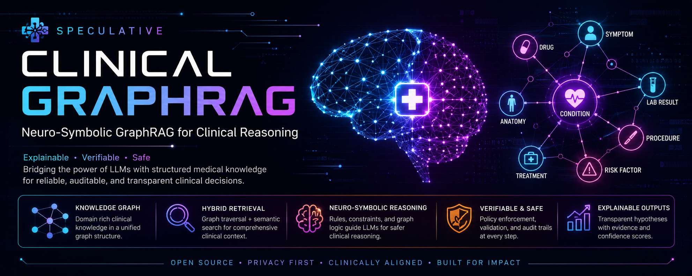
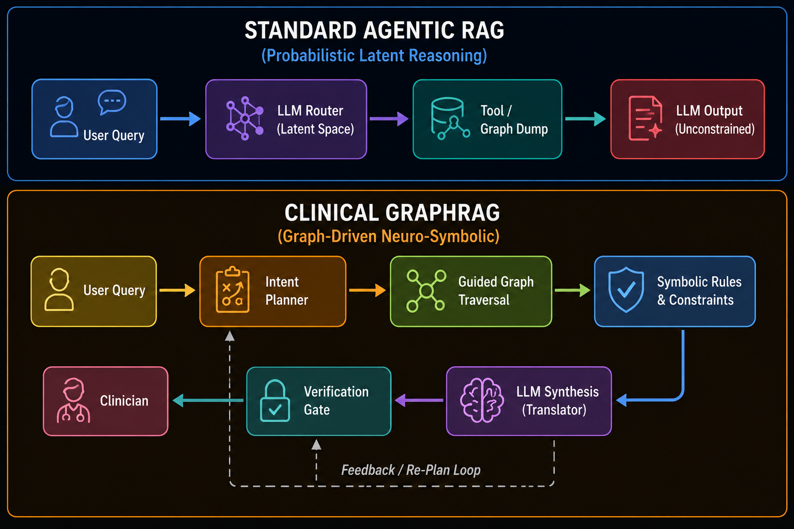
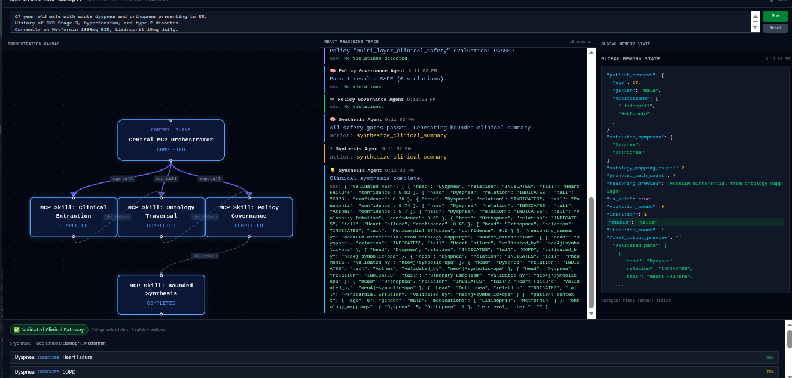

<h1 align="center">Speculative Clinical GraphRAG</h1>

<p align="center">
  
</p>
<p align="center">
  
  
  
  
  
  
  
  
  
  
</p>

<p align="center">
  <b>A Neuro-Symbolic Clinical Decision Support System — Every diagnostic path is symbolically constrained, graph-proven, and OPA-policy verified before natural language synthesis.</b>
</p>

---

## Table of Contents

- [The Paradigm Shift: Graph-Driven Reasoning](#-the-paradigm-shift-graph-driven-reasoning)
- [MAS Glass Box Cockpit (Frontend UI)](#-mas-glass-box-cockpit-frontend-ui)
- [System Execution Flow](#-system-execution-flow)
- [Target 6-Layer Architecture](#-target-6-layer-architecture)
- [MCP & Hub-and-Spoke Topology](#%EF%B8%8F-model-context-protocol-mcp--hub-and-spoke-topology)
- [Features](#-features)
- [Quick Start & E2E Demo Mode](#-quick-start--e2e-demo-mode)
- [Project Directory Structure](#-project-directory-structure)
- [Module & Layer Deep-Dive](#-module--layer-deep-dive)
- [LLM Backends & Bounded Subroutines](#-llm-backends--bounded-subroutines-layer-4-isolation)
- [Testing & Verification](#-testing--verification)
- [License](#-license)

---

## 🎯 The Paradigm Shift: Graph-Driven Reasoning

Standard "GraphRAG" and agentic frameworks suffer from a **Cognitive Control Gap**: they use Knowledge Graphs as passive context dumps while leaving clinical deduction, differential diagnosis, and routing inside the LLM's probabilistic latent space. In a clinical setting, open-ended LLM routing leads to non-deterministic failure loops and hallucinations.

**Speculative Clinical GraphRAG** introduces a fundamental architectural shift into a **Type 2 Symbolic[Neuro] Clinical Decision Support System**:

1. **Explicit Knowledge Control**: Clinical reasoning is moved out of the LLM prompt and into deterministic Python code, Cypher graph traversals, and symbolic rule engines.
2. **LLM as Interface (Demoted Subroutine)**: The fine-tuned LLM (`MedGemma-4B-IT` / `vLLM`) is demoted from "The Brain" to a bounded Layer 4 subroutine responsible only for structured extraction and natural language synthesis.
3. **Zero-Trust Governance**: No diagnostic hypothesis or treatment pathway reaches a clinician without passing structural Cypher proof validation and external Open Policy Agent (OPA) safety checks.

<p align="center">
  
</p>

---

## 🖥️ MAS Glass Box Cockpit (Frontend UI)

The **Multi-Agent System (MAS) Glass Box Cockpit** provides real-time observability into the inner workings of the neuro-symbolic engine. Built with React 18, Vite, Tailwind CSS, and React Flow, it visualizes state transitions, agent handoffs, and policy verification in real time.

<p align="center">
  
</p>

### Interactive Visual Control Zones

| Zone | Component | Description |
| :--- | :--- | :--- |
| **Zone 1** | **Orchestration Canvas** | Renders the live **Hub-and-Spoke MCP Topology**. Displays the `Central MCP Orchestrator` delegating work to 4 specialized `MCP Skill` nodes with real-time status badges (`COMPLETED`, `RUNNING`, `FAILED`). |
| **Zone 2** | **ReAct Reasoning Trace** | Streams granular execution events tagged with semantic indicators: 🧠 *Thought*, ⚡ *Action*, 👁️ *Observation*, and 🛡️ *Policy Safety Verification*. |
| **Zone 3** | **Global Memory State** | Live state inspector displaying active patient demographics, extracted symptoms, ontology mapping counts, and execution status mutations (`valid`, `escalated`). |
| **Zone 4** | **Validated Clinical Pathway** | Formatted diagnostic card displaying validated clinical pathways (`Dyspnea ➔ INDICATES ➔ Heart Failure (92%)`), patient context, and collapsible reasoning proofs. |

---

## 🔄 System Execution Flow

Every clinical request executes across a strictly enforced 6-step deterministic pipeline:

```
User Note ──► Intent Planner ──► Guided Graph Traversal ──► Symbolic Rules & Elimination
    ──► Bounded LLM Synthesis ──► OPA Policy Gate ──► Verified Briefing + Trace
```

1. **Intent Planning**: Query is parsed into a bounded DAG execution plan with sub-goals and required ontology domains.
2. **Guided Traversal**: Cypher queries actively walk symptom-condition-drug graphs (`symptom → related conditions → risk factors → contraindications`).
3. **Symbolic Elimination**: Hardcoded rules and Bayesian constraint engines eliminate clinical impossibilities and rank paths based on grounded evidence strength.
4. **Bounded LLM Synthesis**: The LLM translates verified subgraphs and reasoning paths into structured clinical briefings.
5. **Deterministic Verification**: OPA Rego sidecar policies (<5ms) and sub-50ms native Python fallbacks evaluate safety invariants (e.g., drug interactions, dosing safety).
6. **Delivery & Audit Ledger**: Output is emitted along with an immutable, step-by-step symbolic proof trace.

---

## 🏗 Target 6-Layer Architecture

The codebase decouples execution into six single-responsibility layers:

```
+-----------------------------------------------------------------------------------+
| 1. COGNITIVE ORCHESTRATION LAYER (core/orchestrator.py & core/supervisor.py)      |
|    - Decomposes clinical query into bounded sub-goals                             |
|    - Emits structured execution plan (Intent, Required Nodes, Policy Domain)      |
+---------------------------------------------+-------------------------------------+
                                              v
+-----------------------------------------------------------------------------------+
| 2. ACTIVE KNOWLEDGE TRAVERSAL LAYER (core/retrieval.py & graph/)                      |
|    - Plan-guided Cypher graph traversal (Symptoms -> Conditions -> Contraindications) |
|    - Qdrant hybrid vector extraction for unstructured EHR context                     |
+---------------------------------------------+-------------------------------------+
                                              v
+-----------------------------------------------------------------------------------+
| 3. SYMBOLIC CONSTRAINT & REASONING LAYER (agents/reasoner/ & core/verification.py) |
|    - Deterministic elimination of clinical impossibilities (rules_engine.py)       |
|    - Conflict identification (drug-symptom, allergy-condition)                     |
|    - Bayesian posterior confidence updates & path elimination                      |
+---------------------------------------------+-------------------------------------+
                                              v
+-----------------------------------------------------------------------------------+
| 4. NEURAL EXPRESSION & SYNTHESIS LAYER (agents/synthesizer/ & core/llm_backend.py)   |
|    - Invokes fine-tuned LLM (MedGemma-4B-IT / vLLM / Ollama) strictly as subroutine  |
|    - Converts validated symbolic reasoning paths into clear clinical briefings       |
+---------------------------------------------+-------------------------------------+
                                              v
+-----------------------------------------------------------------------------------+
| 5. DETERMINISTIC GOVERNANCE LAYER (core/verification_layer.py & infra/opa/)       |
|    - OPA/Rego sidecar zero-trust policy verification (<5ms)                       |
|    - Native Python fallback validator (<50ms under OPA timeout)                   |
|    - Structural Cypher proof validation before final response delivery            |
+---------------------------------------------+-------------------------------------+
                                              v
+-----------------------------------------------------------------------------------+
| 6. MEMORY SUBSTRATE & AUDIT LEDGER (core/memory.py & storage/)                    |
|    - Redis Streams for state checkpointing (<15ms hydration)                      |
|    - Append-only event log for 100% deterministic replayability                   |
+-----------------------------------------------------------------------------------+
```

---

## 🛠️ Model Context Protocol (MCP) & Hub-and-Spoke Topology

The architecture enforces the **Model Context Protocol (MCP)** specification via `core/mcp_registry.py` (`MCPRegistry`). Unlike probabilistic agent systems where an LLM calls tools directly, this engine utilizes a **Governed Hub-and-Spoke Control Plane**:

```
                         ┌─────────────────────────┐
                         │  Central MCP            │
                         │  Orchestrator           │
                         └────────────┬────────────┘
                                      │
        ┌─────────────────────────────┼─────────────────────────────┐
        │ mcp:call                    │ mcp:call                    │ mcp:call
        ▼                             ▼                             ▼
┌───────────────────────┐     ┌───────────────────────┐     ┌───────────────────────┐
│ MCP Skill:            │     │ MCP Skill:            │     │ MCP Skill:            │
│ Clinical Extraction   │     │ Ontology Traversal    │     │ Policy Governance     │
└───────────┬───────────┘     └───────────┬───────────┘     └───────────┬───────────┘
            │ obs:return                  │ obs:return                  │ obs:return
            └─────────────────────────────┼─────────────────────────────┘
                                          │
                                          ▼
                               ┌───────────────────────┐
                               │ MCP Skill:            │
                               │ Bounded Synthesis     │
                               └───────────────────────┘
```

### Registered MCP Skills

| Skill / Tool Category | Component | Responsibility |
| :--- | :--- | :--- |
| **`mcp:clinical_extraction`** | `core/retrieval.py` | Extracts structured symptoms and patient demographics from clinical notes. |
| **`mcp:ontology_traversal`** | `core/verification_layer.py` | Performs Cypher graph traversals across SNOMED-CT / ICD-10 ontologies. |
| **`mcp:policy_governance`** | `infra/opa/policies/` | Evaluates multi-layer Rego policies and symbolic safety gates. |
| **`mcp:bounded_synthesis`** | `core/llm_backend.py` | Synthesizes verified diagnostic subgraphs into natural language. |

---

## ✨ Features

| Area | Feature | Status |
|------|---------|--------|
| **Architecture** | Type 2 Symbolic[Neuro] Graph-Driven Reasoning Engine | ✅ |
| **UI Observability**| MAS Glass Box Cockpit with real-time ReAct trace and state inspector | ✅ |
| **MCP Topology** | Governed Hub-and-Spoke Control Plane with `mcp:call` / `obs:return` loops | ✅ |
| **Pipeline** | Verify-then-generate pattern with topological cycle detection | ✅ |
| **Correction Loop**| Automated feedback iterations prior to human escalation | ✅ |
| **LLM Engine** | Bounded local inference via MedGemma-4B-IT, vLLM, Ollama, or MockLLM | ✅ |
| **LLM Subroutines**| Typed JSON schemas (`extract_symptoms`, `assess_differential`) | ✅ |
| **Ontology** | 178+ in-memory ontology triples covering SNOMED-CT, ICD-10, RxNorm | ✅ |
| **Governance** | OPA/Rego sidecar policy engine + sub-50ms native Python fallback validator | ✅ |
| **Retrieval** | Hybrid Qdrant vector search + active Cypher graph traversal + RRF fusion | ✅ |
| **Storage** | Multi-Tiered Memory: Working (Redis), Episodic (Qdrant), Semantic (Neo4j) | ✅ |
| **Tests** | **125 passing, 4 skipped (Docker-only), 0 failing** (~10s runtime) | ✅ |

---

## 🚀 Quick Start & E2E Demo Mode

### Mode 1: Full E2E Production-Authentic Stack (CPU-Optimized)

Run authentic Cypher graph queries, vector similarity searches, and OPA policy checks on CPU without needing a GPU:

```bash
# 1. Clone repository
git clone https://github.com/aragit/speculative-clinical-graphrag.git
cd speculative-clinical-graphrag

# 2. Setup Virtual Environment
python3 -m venv .venv
source .venv/bin/activate
pip install -r requirements.txt

# 3. Spin up Docker Infrastructure (Neo4j, Qdrant, OPA)
docker-compose up -d

# 4. Prepare E2E Demo (Seeds Neo4j, Qdrant, & OPA Rego Policies)
python scripts/prepare_demo.py

# 5. Load Demo Environment
cp .env.demo .env

# 6. Start FastAPI Backend (Terminal 1)
python -m uvicorn api.main:app --host 0.0.0.0 --port 8001 --reload

# 7. Start MAS Glass Box UI (Terminal 2)
cd frontend
npm install
npm run dev
```

Open `http://localhost:5173` to access the cockpit.

### Mode 2: Zero-Dependency Developer Mode (Mock Infra)

Run the entire pipeline and UI instantly without Docker:

```bash
# Launch backend in mock mode
python -m uvicorn api.main:app --host 0.0.0.0 --port 8001 --reload

# In a separate terminal, launch frontend
cd frontend && npm run dev
```

---

## 📁 Project Directory Structure

```
speculative-clinical-graphrag/
│
├── api/                            # FastAPI Application Layer
│   ├── main.py                     # Entrypoint & lifecycle probes
│   ├── schemas.py                  # Pydantic models
│   ├── dependencies.py             # Dependency injection
│   └── middleware.py               # Rate limiting & auth middleware
│
├── core/                           # Neuro-Symbolic Core Engine
│   ├── orchestrator.py             # StateGraph execution & loops
│   ├── workflow.py                 # 9-node state machine workflow
│   ├── supervisor.py               # Central MCP Orchestrator
│   ├── llm_backend.py              # LLM Backends (MedGemma, Ollama, Mock)
│   ├── retrieval.py                # Hybrid RAG retriever (Vector + Cypher)
│   ├── verification_layer.py       # Neo4j, SymbolicVerifier, and OPA integration
│   ├── mas_streamer.py             # SSE streaming engine for MAS events
│   └── mcp_registry.py             # Model Context Protocol tool registry
│
├── schemas/                        # SSE Event Protocol
│   └── mas_events.py               # Pydantic v2 event models
│
├── frontend/                       # MAS Glass Box Cockpit (React + Vite)
│   ├── src/
│   │   ├── components/
│   │   │   ├── MASCockpit.tsx      # Main glass box cockpit interface
│   │   │   ├── DAGCanvas.tsx       # React Flow Hub-and-Spoke MCP canvas
│   │   │   ├── ClinicalSummaryCard.tsx # Diagnostic output card
│   │   │   ├── EscalationCard.tsx  # HITL escalation UI
│   │   │   ├── ReActTrace.tsx      # Streaming reasoning log
│   │   │   └── MemoryState.tsx     # Live JSON state inspector
│   │   └── hooks/
│   │       └── useMASSream.ts      # SSE stream hook for real-time trace
│   ├── package.json
│   └── vite.config.ts
│
├── infra/
│   └── opa/
│       └── policies/
│           └── clinical.rego       # Active Rego policy rules
│
├── scripts/
│   └── prepare_demo.py             # CPU E2E database & policy seeder
│
├── tests/                          # Enterprise Verification Suite (125 tests)
│   ├── test_api.py
│   ├── test_mas_stream.py          # SSE streaming integration tests
│   ├── test_dag_compiler.py
│   ├── test_verification.py
│   └── test_workflow.py
│
├── assets/                         # Documentation screenshots & diagrams
│   └── UI_V3.png                   # MAS Glass Box Cockpit screenshot
├── .env.demo                       # Preconfigured CPU demo environment
├── docker-compose.yml
├── requirements.txt
└── README.md
```

---

## 🤖 LLM Backends & Bounded Subroutines (Layer 4 Isolation)

The system supports four selectable backends via the `RUNTIME_LLM` environment variable:

| Backend | Class | Default Model Target | Primary Use Case |
|---------|-------|---------------------|------------------|
| `mock` | `MockLLMBackend` | — | Zero-GPU local testing & UI demo mode |
| `ollama` | `OllamaBackend` | `gemma2:2b` | Local CPU developer sandbox |
| `deepseek_r1` | `DeepSeekR1Backend` | `deepseek-ai/deepseek-r1-distill-qwen-32b` | Production GPU complex reasoning |
| `medgemma_4b_it` | `MedGemmaBackend` | `google/MedGemma-4B-IT` | Fine-tuned clinical inference engine |

---

### Deterministic LangGraph vs. Probabilistic Routing

Standard Agentic Usage (Probabilistic): LangGraph uses LLMs on conditional edges (if llm_router() == 'tool': ...). The execution path is trapped in the LLM's latent space, leaving it vulnerable to prompt injection, logic loops, and hallucinations.

Our Neuro-Symbolic Usage (Deterministic Chassis): LangGraph is used strictly as a State Machine and State Checkpointer. Edge transitions and node executions are determined by core/dag_compiler.py, topological sorting, Python rule engines, and OPA policy gates. The LLM is confined inside a single node (Layer 4 Synthesis) and has zero authority to alter execution flow.

---

## 🧪 Testing & Verification

Run the full verification suite across all core modules:

```bash
python -m pytest tests/ -vv
```

```
================ 125 passed, 4 skipped in 10.86s ================
```
### Test Area	What It Verifies
| Module | Description |
|--------|-------------|
| Reasoning Extraction | Strict truncation math ensuring clinician traces never break length contracts |
| DAG Compiler | Kahn's algorithm topological sorting & explicit cycle rejection |
| Memory Tiers | Redis working memory fallback & session hydration |
| Governance | Fail-secure policy evaluations with native Python sub-50ms fallback |
| Idempotency | Deterministic payload UUID5 key generation |
| Workflow | End-to-end 9-node state graph execution with correction loops |

---

## 🐳 Docker & CI/CD

| Service | Image | Ports | Profile |
|---------|-------|-------|---------|
| neo4j | `neo4j:5.15-community` | 7687, 7474 | default |
| qdrant | `qdrant/qdrant` | 6333 | default |
| redis | `redis:7-alpine` | 6379 | default |
| opa | `openpolicyagent/opa` | 8181 | default |
| fastapi | *(builds from Dockerfile)* | 8001 | default |
| vllm | `vllm/vllm-openai` | 8000 | gpu |
| jaeger | `jaegertracing/all-in-one` | 16686 | tracing |
---

## 📄 License

MIT License — Clinical AI Research & Engineering
